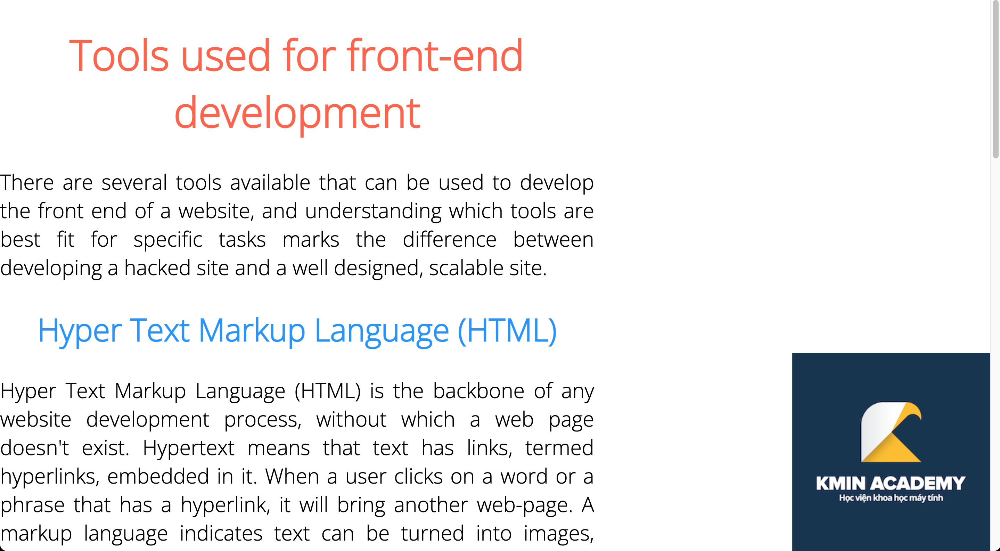

# C03 - CSS

[Yêu cầu](https://kminacademy.notion.site/C03-CSS-1e7fa98d529b4f4c82e09fd9719fb4d6)

## Mục tiêu

- Vận dụng tốt cú pháp của CSS.
- Học viên biết cách lựa chọn thuộc tính định dạng và các giải pháp layout cho phù hợp.
- Học viên lập trình thành thạo với các thuộc tính CSS cơ bản.
- Học viên biết cách đọc tài liệu trong các CSS documents.

## Nhiệm vụ

Sản phẩm cuối cùng cần đạt được:

[c03.mov](./requirements/c03.mov)

Style chung cho tất cả các trang:

```css
@import url("https://fonts.googleapis.com/css2?family=Open+Sans:wght@300&display=swap");
* {
    box-sizing: border-box;
}
body {
    margin: 0;
    font-family: "Open Sans", sans-serif;
}
```

### Nhiệm vụ 1: ex1.html



Mô tả: Lập trình giao diện trang ex1.

Thông số:

- Background cố định: Scroll xuống vẫn giữ nguyên vị trí.
- Chiều rộng vùng hiển thị text chiếm 60% chiều rộng trang web.
- Màu chữ tiêu đề lớn: tomato.
- Màu chữ tiêu đề nhỏ: dodgerblue.

### Nhiệm vụ 2: ex2.html


Mô tả: Lập trình giao diện trang ex2.

Thông số:

- Màu nền: aqua
- Chiều rộng của hình chữ nhật chiếm 30% chiều rộng trang web.
- Chiều cao của hình chữ nhật tự động thay đổi tùy theo nội dung bên trong.
- Hình chữ nhật canh giữa theo chiều ngang của trang web.
- Padding 4 phía của hình chữ nhật đều là 50px.

### Nhiệm vụ 3: ex3.html


Mô tả: Lập trình giao diện trang ex3.

Thông số:

- Chiều cao của cover: 300px.
- Khoảng cách giữa các phần tử được mô tả như sau:


- Kích thước của avatar là 200 x 200px.
- Đường viền của avatar có độ dày 10px.

### Nhiệm vụ 4: ex4.html


Mô tả: Lập trình giao diện trang ex4.

Thông số:

- Màu nền của trang web là gradient từ trái sang phải, chuyển từ màu #fcbf16 sang #992154.
- Khoảng cách giữa các ký tự: 5px.
- Khoảng cách giữa các phần tử được mô tả như sau:


- Trang web không có scroll ngang và dọc.

### Nhiệm vụ 5: index.html


- Mô tả: Lập trình giao diện navigation, mỗi một mục là một liên kết đi đến các trang con: Bấm vào “Excercise 1” sẽ đi đến ex1.html, tương tự với các mục khác.
- Thông số:
    - Kích cỡ chữ: 36px.
    - Màu:
        - Hover: tomato.
        - Active: dodgerblue.
        - Màu nền nav: #3c3939.

## Yêu cầu

- Sản phẩm phải đúng theo yêu cầu, giống với bản thiết kế.
- Sử dụng external CSS.
- Code được viết đẹp, chỉn chu.
- Không mắc lỗi chính tả.